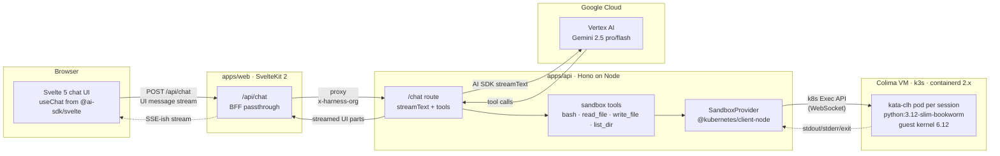
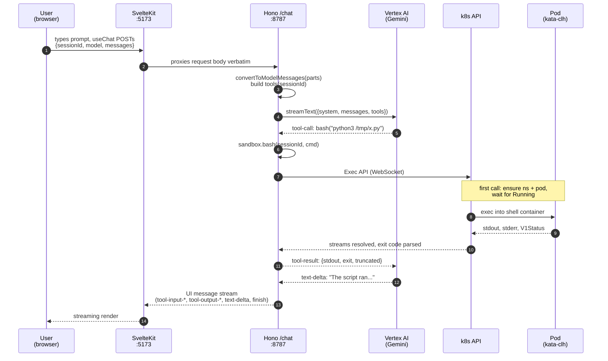
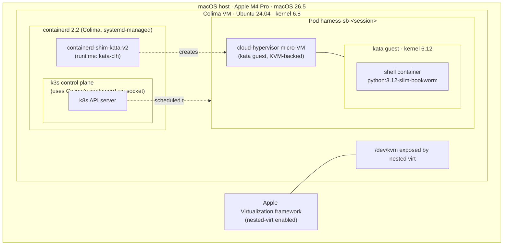
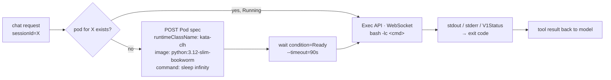

# harness

An AI harness for engineering teams (initial focus: construction). A SvelteKit chat
frontend talks to a Hono backend that calls **Vertex AI Gemini** via the **Vercel AI
SDK**, and the agent has a real **kata-containers** Linux sandbox to run code,
read/write files, and verify its own work — running locally on Apple Silicon
through nested virtualization.

---

## TL;DR

```sh
# one-time
./infra/kata/setup.sh                                  # ~10 min
gcloud auth application-default login                   # ADC for Vertex
cp .env.example .env                                    # adjust GCP project if needed
bun install

# run
GOOGLE_VERTEX_PROJECT=qa1-us-central1-vpc-63b3e2 \
KATA_CONTEXT=colima-harness \
bun dev
# → http://localhost:5173
```

Try: *"Use your bash tool to write a Python script that lists the first 20 primes,
save it as /tmp/primes.py, run it, and show me the output."*

---

## System overview



Three independent processes on your Mac:

- **`tsx watch src/index.ts`** (Hono on `:8787`, **Node 22**) — owns the AI SDK call, tool dispatch, and direct k8s exec into the sandbox via `@kubernetes/client-node`.
- **`vite dev`** (SvelteKit on `:5173`) — serves the chat UI and proxies `/api/chat` to the Hono server.
- **`colima-harness` VM** — Linux + k3s + kata. Independent of the app processes; survives restarts.

---

## Stack

| Layer | Choice | Notes |
|---|---|---|
| api runtime | **Node 22** (TypeScript via `tsx`) | switched off Bun so `@kubernetes/client-node` works natively (Bun fetch can't apply client-cert TLS from kubeconfig) |
| web runtime | **Bun** (vite dev) | unchanged — Vite is happy on Bun |
| Package manager | **Bun workspaces + catalog** | one PM across both apps; matches opencode conventions |
| Monorepo | **Turbo** | dev/build pipelines, env passthrough |
| Frontend | **SvelteKit 2** + **Svelte 5** runes + **Tailwind 4** + **shadcn-svelte** + **bits-ui** | full design system |
| Chat client | **`@ai-sdk/svelte`** `Chat` + `DefaultChatTransport` | UI message stream protocol |
| API server | **Hono 4** + **`@hono/node-server`** | runs on Node's http; long streams just work |
| LLM | **Vercel AI SDK 6** (`ai@6.0.185`) + **`@ai-sdk/google-vertex`** | Gemini 3.1 Pro / 2.5 series via ADC (location=global) |
| k8s client | **`@kubernetes/client-node` 1.4** | direct SDK; pod CRUD via `CoreV1Api`, command exec via `Exec` over WebSocket |
| Auth | **gcloud ADC** | `gcloud auth application-default login` |
| Sandbox runtime | **kata-containers 3.13** w/ **cloud-hypervisor** | real micro-VM, not just a container |
| Local k8s | **k3s** inside **Colima** w/ **vz + nested-virtualization** | Apple's Virtualization.framework on M3+ |
| Container runtime | **containerd 2.2** (config schema **v3**) | Colima's external containerd, not k3s-embedded |
| Style guide | inline over helper, no `else`, no `try/catch`, snake_case in Drizzle | see `AGENTS.md` |

---

## Repo layout

```
harness/
├─ apps/
│  ├─ api/                       Hono server, AI SDK, sandbox
│  │  └─ src/
│  │     ├─ index.ts             @hono/node-server + Hono routes
│  │     ├─ runtime.ts           Effect ManagedRuntime (empty until Phase D)
│  │     ├─ ai/
│  │     │  ├─ models.ts         Vertex provider registry
│  │     │  ├─ system-prompt.ts  base prompt + sandbox doc
│  │     │  └─ tools.ts          AI SDK tools wired to sandbox
│  │     ├─ routes/
│  │     │  ├─ chat.ts           POST /chat → streamText
│  │     │  └─ health.ts         GET /health
│  │     └─ sandbox/
│  │        ├─ provider.ts       per-session pod lifecycle + exec
│  │        └─ smoke.ts          manual test script
│  │
│  └─ web/                       SvelteKit chat UI
│     └─ src/
│        ├─ app.css              tailwind 4 import
│        ├─ app.html             shell
│        ├─ routes/
│        │  ├─ +layout.svelte    css import
│        │  ├─ +page.server.ts   307 → /chat
│        │  ├─ chat/+page.svelte chat UI (model picker, tool render)
│        │  └─ api/chat/+server.ts   BFF passthrough
│        └─ ...
│
├─ infra/
│  └─ kata/
│     ├─ setup.sh                one-shot provisioner
│     ├─ containerd-config.toml  v3 schema with kata runtimes
│     └─ README.md
│
├─ package.json                  bun workspaces + catalog
├─ turbo.json                    dev/build pipelines + env passthrough
├─ tsconfig.json                 base, extends @tsconfig/bun
├─ AGENTS.md                     style rules (cribbed from opencode)
├─ .env.example
├─ .prettierrc                   semi: false, printWidth: 120
└─ .oxlintrc.json
```

---

## A single chat turn — what actually happens



### Provider internals (`apps/api/src/sandbox/provider.ts`)

Pod CRUD and exec all go through `@kubernetes/client-node` directly. One
shared `Exec` instance opens a WebSocket per call; stdin / stdout / stderr are
plain Node streams. Exit codes come from the API server's
`V1Status.details.causes` field on close — no need to wrap the command in an
echo-the-exit-code trick.

```ts
const kc = new k8s.KubeConfig()
kc.loadFromDefault()
kc.setCurrentContext("colima-harness")

const core    = kc.makeApiClient(k8s.CoreV1Api)
const execApi = new k8s.Exec(kc)

// command exec: streams stdin/out/err, resolves with exit code
execApi.exec(NS, podName, "shell", cmd, outStream, errStream, stdinStream, false, (status) => {
  // V1Status → resolve({ stdout, stderr, exit })
})
```

`bash`, `python`, `read_file`, `write_file`, `list_dir`, `search`, `edit_file`,
`fetch_url`, `pip_install`, `apt_install`, `upload`, `download`, `attach` all
compose this same exec primitive — no `kubectl` subprocess anywhere.

---

## Sandbox architecture (the deep part)

This is the work that took the most fighting. The chain runs through **six**
layers of containment:



### Why each layer

1. **`Apple Virtualization.framework` with `vz` vmType + `nestedVirtualization: true`.**
   Apple's Virtualization framework supports nested virt on M3+ silicon and
   macOS 13+. Lima 2.1's `nestedVirtualization: true` flag opts into it — Colima
   0.10's `--nested-virtualization` flag passes that through. Without this,
   `/dev/kvm` doesn't exist inside the VM and any KVM-backed kata variant
   (`kata-clh`, `kata-fc`) refuses to start pods.

2. **A Linux VM (Ubuntu 24.04) instead of running natively on macOS.** Kata
   needs Linux — containerd, kvm, cgroups, the whole stack. Colima boots this
   VM and exposes a Docker/k8s context to the host.

3. **`containerd` (Colima's own, NOT k3s-embedded).** Colima 0.10 with
   `--runtime containerd --kubernetes` runs **one** containerd as a systemd
   service inside the VM, and points k3s at it via
   `--container-runtime-endpoint`. This is non-obvious: kata-deploy's k3s
   overlay assumes k3s's *embedded* containerd, so it wrote a drop-in to
   `/var/lib/rancher/k3s/agent/etc/containerd/config.toml` that nothing was
   reading. We had to lift the kata runtime blocks into
   `/etc/containerd/config.toml` instead.

4. **containerd config schema v3.** containerd 2.x switched the runtime plugin
   path to `[plugins.'io.containerd.cri.v1.runtime'.containerd.runtimes.<name>]`.
   The kata-deploy DaemonSet still writes the v2 schema
   (`[plugins.cri.containerd.runtimes.<name>]`) which containerd 2.x parses
   without error and then **silently ignores**. `infra/kata/containerd-config.toml`
   has the correct v3 stanzas for `kata-clh`, `kata-qemu`, `kata-fc`.

5. **`kata-clh` (cloud-hypervisor) as the runtime class.** Three options were
   available; we picked cloud-hypervisor because it boots fastest
   (~1–2s vs ~3–5s for kata-qemu). kata-fc (firecracker) is also available if
   we ever want it.

6. **The kata guest kernel is 6.12 while the host VM is 6.8.** This is the
   actual proof of isolation: each pod boots its **own** Linux kernel inside a
   cloud-hypervisor VM. A container escape would still hit the kata guest
   kernel, then a hypervisor boundary, then the host VM, before reaching macOS.

### Pod lifecycle



- One pod per `sessionId`. Web UI generates a UUID per browser and persists it
  in `localStorage` under `harness.sessionId`.
- Pod stays alive (`sleep infinity`) across tool calls so the agent has a
  **persistent filesystem and working directory** within a session — exactly
  like a long-running shell.
- No TTL reaper yet. Pods accumulate; clean them up with
  `kubectl --context colima-harness -n harness-sandboxes delete pods --all`.
- Resource limits: `cpu: 2 / memory: 1Gi`. Adjust in `provider.ts`.

### Why Node for the api, Bun for the web

We started with both apps on Bun. The k8s SDK broke in two ways:

1. `fetch` against `https://127.0.0.1:54910` failed with
   `SELF_SIGNED_CERT_IN_CHAIN` because Bun's `fetch` doesn't pick up CAs from a
   custom `https.Agent`.
2. With `NODE_TLS_REJECT_UNAUTHORIZED=0`, requests got past TLS but the
   kubeconfig's **client cert** never reached the wire — Bun's `fetch` ignored
   agent-level `cert`/`key`. Result: 401.

Rather than shell out to `kubectl` (the original workaround), we run the api
process on **Node** via `tsx` — Node's `https.Agent` applies the CA + client
cert correctly, so the SDK works as designed. Bun stays as the package manager
(workspaces, catalog) and as the web dev runtime. Roughly:

```
apps/api  →  Node 22 + tsx          (uses @kubernetes/client-node)
apps/web  →  Bun + Vite             (frontend, no k8s interaction)
pkg mgr   →  Bun                    (install/lockfile/catalog)
```

This split keeps Bun where it shines (fast installs, fast dev for the
frontend) and puts the api on Node where the SDK ecosystem expects to be.

---

## Local setup, in detail

### 1. Prereqs

- Apple Silicon **M3 or newer** (nested virt). On Intel Macs or M1/M2,
  `kata-clh` won't work — fall back to `kata-qemu` (slower TCG mode).
- macOS 13+ (for Virtualization.framework's nested-virt support).
- Bun ≥ 1.3.
- `kubectl` on PATH (Homebrew or `brew install kubernetes-cli`).
- `gcloud` CLI, authed:
  `gcloud auth application-default login` — this writes
  `~/.config/gcloud/application_default_credentials.json` which `@ai-sdk/google-vertex`
  picks up automatically.
- Vertex AI API enabled on your GCP project.

### 2. Kata cluster (`./infra/kata/setup.sh`)

The script automates what we did interactively in this session:

| Step | What it does | Why |
|---|---|---|
| `colima start --profile harness --kubernetes --runtime containerd --vm-type=vz --nested-virtualization --cpu 4 --memory 8 --disk 60` | Boots a Linux VM with k3s and `/dev/kvm` exposed | The base sandbox host |
| `kubectl apply -k kata-rbac/base?ref=3.13.0` | Creates the SA + ClusterRole kata-deploy uses | RBAC must exist before the DaemonSet |
| `kubectl apply -k kata-deploy/overlays/k3s?ref=3.13.0` | DaemonSet that installs kata binaries to `/opt/kata` on each node | Standard upstream install |
| `set image kube-kata=quay.io/kata-containers/kata-deploy:3.13.0` | Pins the image | `:latest` is currently a bash-less arm64 build that crash-loops |
| `set env CREATE_RUNTIMECLASSES=true` | DaemonSet creates the `RuntimeClass` objects | Off by default in the k3s overlay |
| Write `/etc/containerd/config.toml` from `infra/kata/containerd-config.toml` | v3-schema kata runtimes inline | Bypasses kata-deploy's v2-schema drop-in that containerd 2.x ignores |
| `systemctl restart containerd` | Re-reads config | kata runtimes become visible to CRI |
| Smoke test with `runtimeClassName: kata-clh` | Pod runs and exits 0 | Proves the chain works end-to-end |

### 3. Env

`.env.example` documents all relevant vars; passed through to apps by `turbo.json`'s `globalPassThroughEnv`:

```
GOOGLE_VERTEX_PROJECT=qa1-us-central1-vpc-63b3e2
GOOGLE_VERTEX_LOCATION=us-central1

API_PORT=8787
API_URL=http://localhost:8787

KATA_CONTEXT=colima-harness
KATA_NAMESPACE=harness-sandboxes
KATA_RUNTIME_CLASS=kata-clh
SANDBOX_IMAGE=python:3.12-slim-bookworm
```

### 4. Run

`bun dev` runs `turbo run dev --parallel` which boots both apps. SvelteKit's
HMR + Bun's `--watch` mean edits reload immediately.

---

## Frontend in 90 seconds

`apps/web/src/routes/chat/+page.svelte`:

```svelte
const chat = new Chat({
  transport: new DefaultChatTransport({
    api: "/api/chat",
    body: () => ({ model, sessionId }),
  }),
})

chat.sendMessage({ text })
// chat.messages is reactive; iterate parts and render
```

`@ai-sdk/svelte`'s `Chat` class handles streaming UI messages, tool-call state
transitions (`tool-input-start` → `tool-input-delta` → `tool-input-available` →
`tool-output-available`), and exposes `status` ∈
`{ ready, submitted, streaming, error }`.

The chat page renders **tool calls inline** under their assistant turn, so you
can see what the agent is doing as it does it:

```
> compute beam deflection ...

ASSISTANT
  ╭ write_file   output-available
  │ input:  { path: "/tmp/beam.py", content: "..." }
  │ output: { ok: true, path: "/tmp/beam.py", bytes: 295 }
  ╰
  ╭ bash         output-available
  │ input:  { command: "python3 /tmp/beam.py" }
  │ output: { stdout: "Calculated deflection: 40.69 mm", exit: 0 }
  ╰
  Based on the provided specifications, the deflection is 40.69 mm…
```

---

## Backend in 90 seconds

```mermaid
flowchart LR
  IDX[src/index.ts<br/>Hono + Bun.serve<br/>idleTimeout: 0]
  HEALTH[/routes/health.ts<br/>GET /health/]
  CHAT[/routes/chat.ts<br/>POST /chat/]
  MODELS[ai/models.ts<br/>vertex registry]
  PROMPT[ai/system-prompt.ts]
  TOOLS[ai/tools.ts<br/>bash / read_file<br/>write_file / list_dir]
  PROV[sandbox/provider.ts<br/>@kubernetes/client-node]

  IDX --- HEALTH
  IDX --- CHAT
  CHAT --> MODELS
  CHAT --> PROMPT
  CHAT --> TOOLS
  TOOLS --> PROV
```

`POST /chat` is just:

```ts
streamText({
  model: models[modelId],
  system: baseSystemPrompt,
  messages: await convertToModelMessages(input.messages),
  tools: sandboxTools(sessionId),
  stopWhen: stepCountIs(10),
}).toUIMessageStreamResponse()
```

`stopWhen: stepCountIs(10)` lets Gemini iterate up to 10 tool-use rounds in a
single user turn. Without it, the agent would call one tool and stop.

---

## Decisions and tradeoffs

### Effect-TS scaffold but no Effect-yet

`apps/api/src/runtime.ts` exists with an empty `Layer.empty` and a
`ManagedRuntime.make(...)`. It pays off when there's more than one service to
compose. Right now there's only the sandbox provider, and routing a single
service through Effect would be ceremony. **Phase D** (cortex/talos/wine2o2
clients + skills + MCP host) is where we wire actual layers and convert the
plain async functions to Effect services.

### shadcn-svelte not yet

Chat is a single view with a small set of primitives — input, scrolling list,
select. Adding shadcn-svelte now means a tooling step (`components.json`, CLI)
for things we could draw in 30 lines of Tailwind. We add it the moment a second
view lands (sources/skills/MCP pages).

### Single shared default sessionId fallback

The API accepts `sessionId` from the body; web persists one per browser. If a
client doesn't send one, we fall back to `"default"`. That means *anyone hitting
the API anonymously shares one pod.* Fine for solo dev, not for production —
**every untrusted caller must get an isolated session**.

### `local-docker` provider removed

The original plan had a Mac-fallback `local-docker` SandboxProvider for hosts
without nested virt. Since we proved kata works on M4 Pro, the fallback is
dead code we didn't ship. We'll re-add it if we ever need to run the harness
on Intel Macs or M1/M2.

---

## Known limitations

| Limitation | Why | Mitigation |
|---|---|---|
| No pod TTL / reaper | Out of scope for first cut | `kubectl -n harness-sandboxes delete pods --all` |
| ~~`kubectl` shellout overhead~~ | resolved — apps/api runs on Node with `@kubernetes/client-node` direct exec | |
| No persistence (chat history) | No DB yet | Phase D adds Drizzle + cortex sessions |
| Tool output is JSON-dumped in UI | No per-tool renderer | Custom renderers when shadcn-svelte lands |
| `setup.sh` not idempotent across kata-deploy v2-vs-v3 schema regressions | Each kata-deploy restart re-writes its drop-in (we don't use it, but it's noise) | Document; the symlink hack is in `infra/kata/README.md` |
| Recreating the Colima VM (`colima delete --data`) wipes the kata install | Volume backs all VM state | Re-run `./infra/kata/setup.sh` |
| Only Vertex (Gemini) | Anthropic also planned | Phase D: add `@ai-sdk/anthropic` to the model registry |

---

## What's next

Roughly in order of utility:

1. **Pod TTL reaper.** A background loop in `apps/api` that deletes
   `harness-sb-*` pods idle > N minutes.
2. **Anthropic (Claude) in the model registry.** Same pattern as Vertex,
   different env var. The model picker UI gets two more entries.
3. **`packages/clients`** — typed wrappers for `cortex`, `talos`, `wine2o2`.
   Effect services with `Context.Tag` + default `Layer`.
4. **`packages/core`** — domain services that compose the clients:
   `Sources`, `Skills`, `Retrieve`, `Memory`. Each becomes an Effect service.
5. **Source ingestion pipeline.** Upload PDF/URL → wine2o2 → cortex resource.
6. **Skills CRUD UI** with cortex sync.
7. **MCP host** — `experimental_createMCPClient` per-session for HTTP/SSE
   transports first, stdio later via an extracted bridge service.
8. **Org context middleware** — read `x-harness-org` from the SvelteKit BFF,
   translate to cortex tenant headers in the api server.
9. **shadcn-svelte init** when the second view (sources or skills) lands.
10. **kata-qemu fallback path** for non-M3+ hosts, plus a `local-docker`
    provider for hosts without any Linux VM.

---

## Style guide

See `AGENTS.md`. Quick highlights:

- Inline single-use logic; don't extract preemptively.
- No `try`/`catch` unless absolutely necessary; prefer early returns.
- No `else` — early returns instead.
- No `any`; rely on inference.
- Prefer Bun APIs (`Bun.file`, `Bun.spawn`).
- Drizzle: snake_case columns, no column-name strings.
- Effect: don't return `Effect` from synchronous helpers.

---

## Working theory of operation

If you want a one-paragraph mental model: this is a **streaming function** from
chat messages to chat messages. SvelteKit's BFF and the Hono API just shuttle
bytes; the model lives at Vertex and decides when to "step out" by emitting
tool calls. Each tool call resolves to a k8s `Exec` API call into a long-lived pod
that the model owns for the duration of its session. The pod is a real
isolated kernel running inside a real micro-VM running inside a Linux VM
running inside macOS — five boundaries between the agent's `rm -rf /` and
your laptop. That's the whole product surface right now; everything else
is the path to making it more useful (memory, sources, skills, MCP) while
keeping that core loop intact.
