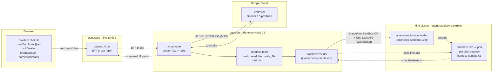
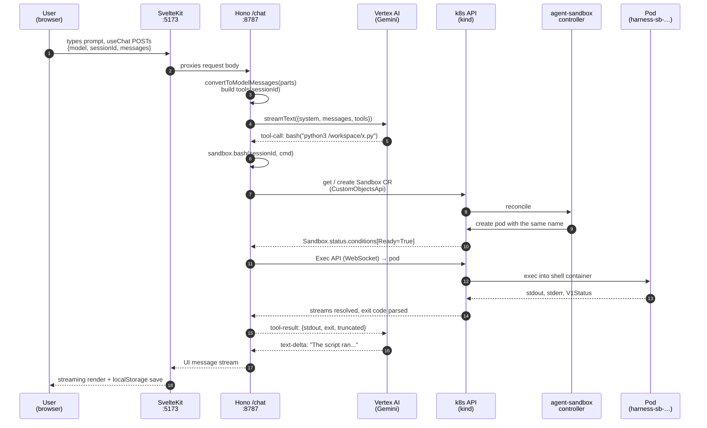

# harness

An AI harness for engineering teams (initial focus: construction). A SvelteKit
chat frontend talks to a Hono backend that calls **Vertex AI Gemini** via the
**Vercel AI SDK**, and the agent has a real Linux sandbox to run code,
read/write files, and verify its own work. Each chat is backed by a
per-session pod managed by the upstream
[**agent-sandbox**](https://agent-sandbox.sigs.k8s.io/) controller on a local
[kind](https://kind.sigs.k8s.io/) cluster.

No sign-in, no database. Chats live in browser `localStorage`.

> **New to the project? Start with [SETUP.md](SETUP.md)** — step-by-step
> "run on another machine" guide.

---

## TL;DR

```sh
# one-time
./infra/agent-sandbox/setup.sh         # kind cluster + agent-sandbox controller + sandbox image
gcloud auth application-default login   # ADC for Vertex
cp .env.example .env                    # set GOOGLE_VERTEX_PROJECT
pnpm install

# every-boot
pnpm sandbox:up                         # docker start the kind node + wait for controller

# run
pnpm dev                                # http://localhost:5173
```

Try: *"Use your bash tool to write a Python script that lists the first 20
primes, save it as /workspace/primes.py, run it, and show me the output."*

---

## System overview



Two local processes:

- **`tsx watch src/index.ts`** (Hono on `:8787`, **Node 22**) — AI SDK call,
  tool dispatch, k8s API access via `@kubernetes/client-node`.
- **`vite dev`** (SvelteKit on `:5173`) — chat UI; proxies `/api/*` to Hono.

…plus the **kind cluster** (a Docker container) hosting k8s with the
agent-sandbox controller installed. Independent of the app processes;
survives app restarts.

---

## Stack

| Layer | Choice | Notes |
|---|---|---|
| api runtime | **Node 22** (TypeScript via `tsx`) | required for `@kubernetes/client-node`'s TLS / client-cert handling |
| web runtime | **Node + Vite** | SvelteKit dev server |
| Package manager | **pnpm 10** workspaces + catalog | one PM across both apps |
| Monorepo | **Turbo** | dev/build pipelines, env passthrough |
| Frontend | **SvelteKit 2** + **Svelte 5** runes + **Tailwind 4** + **shadcn-svelte** + **bits-ui** | full design system |
| Chat client | **`@ai-sdk/svelte`** `Chat` + `DefaultChatTransport` | UI message stream protocol |
| Chat persistence | **browser localStorage** | `harness.threads` index + `harness.thread.<id>` records. No server DB. |
| API server | **Hono 4** + **`@hono/node-server`** | runs on Node's http; long streams just work |
| LLM | **Vercel AI SDK** + **`@ai-sdk/google-vertex`** | Gemini 2.5 / 3 family via ADC |
| Vertex auth | **gcloud ADC** | `gcloud auth application-default login` |
| k8s client | **`@kubernetes/client-node` 1.4** | direct SDK; `Sandbox` CR CRUD via `CustomObjectsApi`, command exec via `Exec` over WebSocket |
| Sandbox controller | **[agent-sandbox](https://agent-sandbox.sigs.k8s.io/) v0.4.6** | `Sandbox` / `SandboxTemplate` CRDs + controller |
| Local k8s | **[kind](https://kind.sigs.k8s.io/)** (Kubernetes-in-Docker) | one container per cluster node |
| Style guide | inline over helper, no `else`, no `try/catch` | see `AGENTS.md` |

---

## Repo layout

```
harness/
├─ apps/
│  ├─ api/                       Hono server, AI SDK, sandbox
│  │  └─ src/
│  │     ├─ index.ts             @hono/node-server + Hono routes
│  │     ├─ ai/
│  │     │  ├─ models.ts         Vertex (ADC) model builder
│  │     │  ├─ system-prompt.ts  base prompt
│  │     │  └─ tools.ts          AI SDK tools wired to sandbox
│  │     ├─ routes/
│  │     │  ├─ chat.ts           POST /chat → streamText
│  │     │  ├─ sandbox.ts        upload/download files
│  │     │  └─ health.ts         GET /health
│  │     └─ sandbox/
│  │        ├─ provider.ts       Sandbox CR lifecycle + exec
│  │        └─ smoke.ts          manual test script
│  │
│  └─ web/                       SvelteKit chat UI
│     └─ src/
│        ├─ lib/
│        │  ├─ threads.ts        localStorage thread CRUD
│        │  ├─ models.ts         re-exports @harness/shared models
│        │  ├─ proxy.ts          BFF passthrough to apps/api
│        │  └─ components/chat/  Sidebar, ModelPicker, ToolPart, FileCard, …
│        └─ routes/
│           ├─ +page.server.ts   307 → /chat
│           ├─ chat/+page.svelte chat UI (sidebar + per-thread Chat)
│           └─ api/[...path]/    BFF: forwards to apps/api
│
├─ packages/shared/              ModelInfo + Gemini model registry
├─ infra/
│  ├─ sandbox/Dockerfile         harness-sandbox:1 (Debian + Python + Node + tools)
│  └─ agent-sandbox/
│     ├─ setup.sh                one-shot provisioner (kind + controller + image)
│     ├─ start.sh                every-boot helper
│     └─ README.md
│
├─ SETUP.md                      "run on another machine" walkthrough
├─ package.json                  pnpm workspaces
├─ turbo.json                    dev/build pipelines + env passthrough
├─ AGENTS.md                     style rules
├─ .env.example
└─ .prettierrc / .oxlintrc.json
```

---

## A single chat turn — what actually happens



### Provider internals (`apps/api/src/sandbox/provider.ts`)

The provider talks to two k8s APIs:

- `CustomObjectsApi` — CRUD on `Sandbox` CRs in the
  `agents.x-k8s.io/v1alpha1` group. `ensureSandbox` creates the CR if missing,
  then polls `status.conditions[type=Ready, status=True]`.
- `Exec` — WebSocket into the pod the controller materialized. The pod name
  equals the Sandbox name, so exec targets `sandboxName(sessionId)` directly.
  Exit codes come from `V1Status.details.causes` on close.

```ts
const cuapi   = kc.makeApiClient(k8s.CustomObjectsApi)
const execApi = new k8s.Exec(kc)

// create Sandbox CR (controller materializes a pod with the same name)
await cuapi.createNamespacedCustomObject({
  group: "agents.x-k8s.io",
  version: "v1alpha1",
  namespace: NS,
  plural: "sandboxes",
  body: sandboxBody(sessionId),
})

// later: exec into the pod
execApi.exec(NS, sandboxName(sessionId), "shell", cmd, outStream, errStream, stdinStream, false, (status) => {
  // V1Status → resolve({ stdout, stderr, exit })
})
```

`bash`, `python`, `read_file`, `write_file`, `list_dir`, `search`, `edit_file`,
`fetch_url`, `pip_install`, `apt_install`, `upload`, `download`, `attach` all
compose this same exec primitive — no `kubectl` subprocess anywhere.

---

## Backend in 90 seconds

`POST /chat` is essentially:

```ts
streamText({
  model: buildModel(modelId),           // vertex(modelId) — ADC, no key
  system: baseSystemPrompt,
  messages: await convertToModelMessages(input.messages),
  tools: sandboxTools(sessionId),
  stopWhen: stepCountIs(20),
}).toUIMessageStreamResponse()
```

`stopWhen: stepCountIs(20)` lets Gemini iterate up to 20 tool-use rounds in a
single user turn.

---

## Frontend in 90 seconds

`apps/web/src/routes/chat/+page.svelte`:

```svelte
const chat = new Chat({
  messages: thread.messages,
  transport: new DefaultChatTransport({
    api: "/api/chat",
    body: () => ({ model: thread.model, sessionId: thread.sandbox_session_id }),
  }),
})

chat.sendMessage({ text })
// chat.messages is reactive; iterate parts and render
// debounced effect writes chat.messages → localStorage on every change
```

The Chat object holds messages in memory; an `$effect` debounces writes to
`localStorage` (`harness.thread.<id>`). The sidebar reads the index
(`harness.threads`) to render the thread list.

Tool calls render inline under their assistant turn so you can see what the
agent is doing as it does it.

---

## Decisions and tradeoffs

### Why agent-sandbox / kind locally

`agent-sandbox` (kubernetes-sigs) gives a small, opinionated CRD surface
(`Sandbox`, `SandboxTemplate`, `SandboxClaim`, `SandboxWarmPool`) on top of
plain Kubernetes pods. By creating a `Sandbox` CR per chat we get pod
lifecycle, status conditions, and a clean place to attach future features
(warm pools, claims, templates) without rolling our own controller.

`kind` is the simplest way to host that on a developer laptop: one Docker
container per cluster node, ~30s cold boot, works wherever Docker works.

### Container isolation, not micro-VM

The default Sandbox pod is a stock Linux container (cgroups + namespaces).
For stronger isolation, install [gVisor](https://gvisor.dev/) and a
`gvisor` `RuntimeClass`, then set `SANDBOX_RUNTIME_CLASS=gvisor` —
`provider.ts` already plumbs the runtime-class through to the pod spec.

### No persistence on the server

Chats live in `localStorage` under `harness.threads` (index) and
`harness.thread.<id>` (full record with messages). Closing the tab keeps
them; clearing site data clears them. No accounts, no shared state, no
sync across devices. This keeps the local stack to **two processes + one
cluster** and removes the entire auth / DB attack surface for a single-user
demo.

If you want multi-device sync or sharing later, the natural place to add
that is a new `/threads/*` route on the API backed by Postgres + better-auth
(see the project history for one shape that worked).

### Single shared default sessionId fallback

The API accepts `sessionId` from the body; the web sets one per thread. If
a client doesn't send one, we fall back to `"default"`. Fine for solo dev,
not for production — every untrusted caller must get an isolated session.

---

## Known limitations

| Limitation | Mitigation |
|---|---|
| No pod TTL / reaper | `kubectl --context kind-harness-agent-sandbox -n harness-sandboxes delete sandbox --all` |
| Tool output is JSON-dumped in UI | Add per-tool renderers when more tools land |
| Only Vertex Gemini in the model registry | Add other providers + env keys later |
| `localStorage` is per-browser-per-origin | Clear via devtools → Application → Local Storage |

---

## Style guide

See `AGENTS.md`. Quick highlights:

- Inline single-use logic; don't extract preemptively.
- No `try`/`catch` unless absolutely necessary; prefer early returns.
- No `else` — early returns instead.
- No `any`; rely on inference.
- Effect: don't return `Effect` from synchronous helpers.

---

## Working theory of operation

A one-paragraph mental model: this is a **streaming function** from chat
messages to chat messages. SvelteKit's BFF and the Hono API just shuttle
bytes; the model lives at Vertex and decides when to "step out" by emitting
tool calls. Each tool call resolves to a k8s `Exec` API call into a
long-lived pod that the model owns for the duration of its chat. The pod is
provisioned by the agent-sandbox controller from a `Sandbox` custom
resource, so its lifecycle, status, and configuration are all standard
Kubernetes objects — no bespoke controller code in this repo. Chat history
lives in the browser, not on a server.
